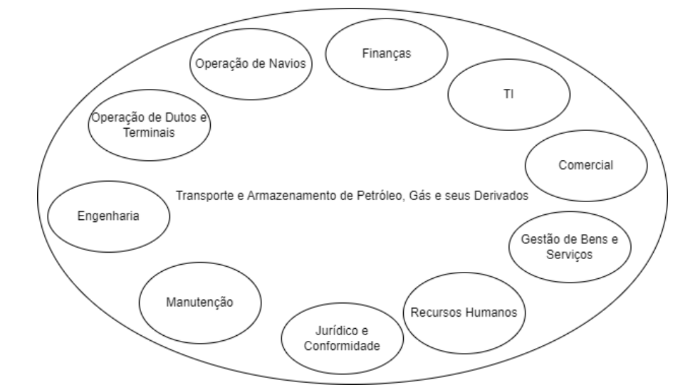
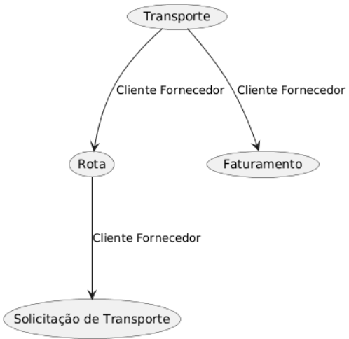
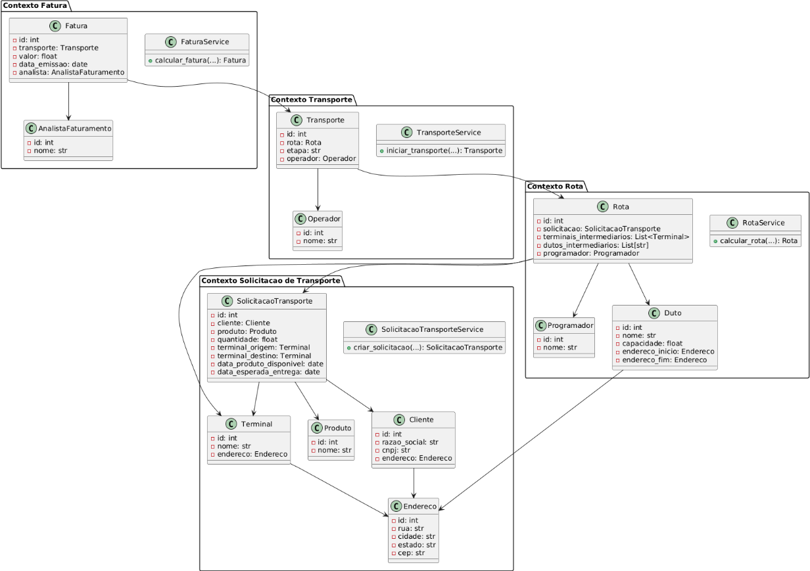

Por: Bruno Rodrigues Pacheco
Caro professor Victor (perdão pelo erro no nome rsrs),
Neste artigo exploraremos a modelagem de domínio utilizando DDD (Domain Driven Design) no âmbito da empresa Transpetro e seus processos.

1 - Modelo de Negócio
A Transpetro é uma subsidiária integral da Petrobras e opera um modelo de negócio focado na logística e transporte de petróleo, derivados, gás natural e biocombustíveis. A empresa gerencia uma frota de navios petroleiros que transportam produtos entre plataformas offshore, refinarias e mercados consumidores, tanto nacionais quanto internacionais. Além disso, a Transpetro opera uma extensa rede de dutos que facilita o transporte seguro e eficiente de produtos energéticos entre regiões produtoras, refinarias e centros de distribuição. A empresa também opera terminais de armazenamento, garantindo o recebimento, armazenamento e expedição contínuos dos produtos. Para explorar melhor o modelo de negócio da empresa e utilizarmos o DDD, precisamos mapear os domínios e subdomínios principais da companhia. O termo subdomínio é bem genérico, de forma que dentro de um subdomínio podemos ter outros subdomínios.
O mapa de domínio a seguir mostra o domínio e subdomínios mapeados dentro da companhia:

Dentre os domínios mostrados, vamos utilizar o subdomínio de Operação de Dutos e Terminais para realizar nosso trabalho de modelagem estratégica em DDD.
No subdomínio de Operação de Dutos e Terminais, vamos simular uma operação de transporte de carga conforme descrito abaixo:
A operação de transporte de petróleo e derivados na Transpetro envolve uma série de etapas coordenadas que garantem a eficiência e a segurança do processo. Tudo começa com o cliente, que precisa transportar uma carga específica de um terminal de origem para um terminal de destino. O cliente acessa o Sistema de Transporte da Transpetro (STP) e faz uma Solicitação de Transporte, fornecendo detalhes como tipo de produto, quantidade em toneladas, terminal de origem, terminal de destino, data do produto disponível no terminal de origem e data esperada de entrega da carga.
Uma vez que a solicitação é recebida, o programador da Transpetro entra em ação para realizar o Planejamento de Rotas. Este processo envolve o cálculo da rota mais eficiente para o transporte da carga, considerando a capacidade, datas e disponibilidade dos dutos. Utilizando algoritmos e dados operacionais, o programador determina a melhor rota, garantindo que o transporte seja realizado de forma segura e nas datas solicitadas pelo cliente. A rota calculada é então registrada no STP para que o cliente tenha visibilidade.
A inserção da rota no STP inclui a notificação dos operadores de dutos e terminais sobre a nova programação, assegurando que todos estejam cientes dos próximos passos.
Antes de iniciar a movimentação do produto, o operador de dutos precisa consultar a rota definida. Esta etapa é essencial para garantir que o operador esteja plenamente ciente dos detalhes da rota. Após a consulta e verificação, o operador pode então proceder para iniciar a movimentação do produto da origem ao destino através dos dutos interagindo com os responsáveis locais nos Terminais.
Durante todo o processo de transporte, o operador de dutos realiza o monitoramento do transporte . Este monitoramento é feito em tempo real na interação do operador de dutos com os responsáveis locais. O Transporte é monitorado até o descarregamento no terminal de destino. Quando o produto chega ao terminal de destino, o operador de dutos faz esta notificação do STP.
Após a conclusão do transporte, o analista de faturamento emite uma fatura detalhada para o cliente, especificando todos os serviços prestados e os custos associados. 
Conforme verificado acima, existem diversos termos extremamente importantes que são utilizados neste subdomínio e que devem ser conhecidos pelo time de desenvolvimento de software para que a construção do sistema seja alinhada com a linguagem que o negócio também utiliza. Isso é chamado de linguagem ubíquoa. Abaixo temos uma wiki com os termos mais importantes utilizados:
Glossário de Termos
Solicitação de Transporte: Solicitação realizada pelo cliente no SPT para a movimentação de uma carga.
Cliente: Ator que realiza a solititação de tranporte de uma carga e também é cobrado pela mesma depois.
Rota: Caminho planejado para o transporte de carga através dos terminais e dutos, definido pelo programador.
Programação: Processo de inserir e gerenciar as rotas calculadas no sistema.
Transporte: Ação de movimentar a carga através dos dutos, desde o carregamento até o descarregamento. É também o identificador principal dentro do sistema. Possui a etapa em que o transporte está.
Fatura: Documento emitido para cobrar o cliente pelos serviços de transporte prestados.
Terminal: Instalação onde o petróleo ou derivados são carregados ou descarregados.
Duto: Tubulação usada para transportar petróleo ou derivados entre terminais.
Capacidade: Quantidade máxima de produto que um duto pode transportar de forma segura em um determinado intervalo de tempo.
Carga: Informação sobre a quantidade e produto a ser transportada de um terminal de origem para um terminal de destino.

2 - Modelagem Estratégica (Mapa de Contextos)
Para seguir nossa abordagem, precisamos definir o que é modelagem estratégica em DDD: é um conjunto de práticas e ferramentas utilizadas para entender, definir e organizar o domínio de um problema de forma que possa ser abordado de maneira eficiente e eficaz. Este processo ajuda a dividir um sistema complexo em partes menores e mais gerenciáveis, permitindo que equipes de desenvolvimento se concentrem em áreas específicas do sistema com maior clareza e coesão. Além disso, geralmente estas subdivisões também costumam representar a forma como uma empresa está organizada. Muitas vezes estas partes menores são conhecidas como contexto. Podemos também referenciar os contextos por subdomínios em determinadas situações.
Abaixo, temos o mapa de contextos criado para o subdomínio escolhido: 

A relação entre Solicitação de Transporte e Transporte é cliente fornecedor com Solicitação de Transporte apontando para Transporte pois o Transporte precisa das informações da Solicitação de Transporte.
A relação entre Transporte e Rota é cliente fornecedor sendo Rota apontando para Transporte pois o Transporte precisa das informações da Rota.
A relação entre Transporte e Faturamento é cliente fornecedor sendo Transporte apontando para Rota pois a Rota precisa das informações de Transporte para gerar a fatura.

3 - Modelagem Tática
Para seguir com a abordagem, precisamos explicar o que é modelagem tática e, combinando DDD e UML, explicar o que são blocos de construção e definir quais serão utilizados para cada contexto mapeado.
A Modelagem Tática em Domain-Driven Design (DDD) é uma abordagem que foca na implementação detalhada dos modelos de domínio dentro de cada bounded context. Diferentemente da modelagem estratégica, que lida com a organização de grandes componentes e suas interações, a modelagem tática concentra-se em definir os detalhes e as estruturas internas dos modelos, como entidades, objetos de valor, agregados, repositórios, serviços, e fábricas. A modelagem tática fornece ferramentas e padrões para desenvolver um modelo de domínio rico e expressivo que captura a lógica de negócios de forma precisa.
Os "blocos de construção" são os padrões e ferramentas que você usa para implementar os modelos de domínio detalhadamente dentro de cada contexto delimitado (Bounded Context). Eles ajudam a estruturar o código de forma que ele reflita a lógica de negócios de maneira precisa e expressiva. No nosso projeto, vamos modelar estes blocos de construção para o contexto delimitado escolhido que, no nosso entendimento, se trata do subdomínio core do nosso negócio.

Abaixo listamos quais são os principais blocos de contrução e quais deles usamos na modelagem que estamos desenvolvendo:
Os principais blocos de construção em DDD são:
Entidades: Objetos que têm uma identidade distinta e persistente ao longo do tempo.
   - Exemplos: Cliente, Terminal de Origem, Terminal de Destino, Duto, AnalistaFaturamento, Operador, Programador
Objetos de Valor: Objetos que são definidos por seus atributos e não têm identidade própria.
   - Exemplo: Endereço, Razão Social, CNPJ, Produto, Quantidade, Data Produto Disponível, Data Esperada de Entrega, Valor (da Fatura), Data de Emissão (da Fatura), Etapa (do Transporte).
Agregados: Conjuntos de entidades e objetos de valor que são tratados como uma unidade única para fins de consistência.
   - Exemplo: Solicitação de Transporte, Rota, Fatura, Transporte
Serviços: Operações que não pertencem naturalmente a uma entidade ou objeto de valor.
   - Exemplo: SolicitacaoTransporteService, RotaService, FaturaService, TransporteService

4 - Diagrama de Classes
Abaixo segue o diagrama UML dos contextos e das classes definidas no trabalho:

O diagrama de classes mostra que temos uma dependência de código fonte entre algumas classes. A relação entre as entidades, agregados e objetos de valor realmente cria cenários em que esta situação acontece.

5 - Aplicação dos Princípios SOLID
Foi solicitado agora que explicássemos de forma textual como poderíamos aplicar ao menos 3 conceitos do SOLID em algum dos nossos contextos. Vamos demonstrar cada conceito já aplicando e trazendo informações do contexto selecionado. Selecionamos o contexto Solicitação de Transporte.

Single Responsibility Principle (SRP) – Princípio da Responsabilidade Única: Este princípio destaca que cada classe deve ter apenas uma responsabilidade, e consequentemente somente um motivo para ser alterada, ou seja, somente quando elementos internos pertinentes àquela entidade são alterados. Esse conceito já foi aplicado em nosso projeto no contexto selecionado quando a classe SolicitacaoTransporte representa apenas os dados da solicitação, enquanto a classe SolicitacaoTransporteService cuida da lógica de criação e validação.

Open/Closed Principle (OCP) – Princípio Aberto/Fechado: Este princípio destaca que as Classes devem estar abertas para extensão, mas fechadas para modificação, ou seja, quando novos comportamentos e recursos precisam ser adicionados no software, devemos estender e não alterar o código fonte original para evitar alterar algo que já estava funcionando. Na prática, para adicionar novas regras de validação ou atributos, poderíamos criar subclasses de serviço. Em nosso projeto, poderíamos aplicar este princípio ao adicionar regras de validação para a criação de uma nova solicitação criando subclasses da Classe SolicitacaoTransporte.

Dependency Inversion Principle (DIP) – Princípio da Inversão de Dependência: Este princípio destaca que as classes (ou outro elemtno, mas para o nosso caso aqui, é o mais concreto) devem depender de abstrações e não de implementações concretas. Podemos observar isso também afirmando que módulos de alto nível não devem depender de módulos de baixo nível. O que é mais usado nas implementações é a utilização de Interfaces para realizar as interações entre classes de níveis diferentes. Em nosso projeto, não chegamos a este nível de detalhe, mas poderíamos utilizar este conceito facilmente quando implementássemos uma base de dados para armazenar dados de clientes, por exemplo, e utilizarmos interfaces para a comunicação de um Repository com uma base SQL Server para persistir informações.

6 - Aplicação dos Princípios do Padrão GRASP e Relação com Padrões de Projeto

No contexto de Solicitação de Transporte, é possível aplicar diversos princípios do GRASP para tornar o sistema mais robusto, flexível e alinhado com boas práticas de orientação a objetos. Além disso, muitos desses princípios se relacionam diretamente com os padrões de projeto clássicos descritos no livro Design Patterns: Elements of Reusable Object-Oriented Software. Abaixo, explicamos como cada princípio pode ser utilizado, avaliamos se já foi aplicado na modelagem desenvolvida e mostramos sua relação com padrões de projeto conhecidos:

Baixo Acoplamento: Este princípio recomenda que as classes tenham o mínimo de dependências diretas entre si, facilitando a manutenção e evolução do sistema. No nosso projeto, o baixo acoplamento é observado ao separar a lógica de criação e validação em um serviço específico (`SolicitacaoTransporteService`), enquanto a entidade `SolicitacaoTransporte` mantém apenas os dados. Isso permite que alterações em regras de negócio não impactem diretamente a estrutura dos dados, e vice-versa. Padrões de projeto como Adapter, Facade e Observer ajudam a promover baixo acoplamento ao intermediar ou desacoplar dependências entre classes.

Alta Coesão: Classes com alta coesão concentram responsabilidades relacionadas e afins, tornando o código mais compreensível e fácil de manter. No contexto modelado, cada classe tem uma responsabilidade clara: a entidade `SolicitacaoTransporte` representa os dados da solicitação, enquanto o serviço cuida da criação e validação. Essa separação garante que cada classe tenha um propósito bem definido, o que já foi aplicado na modelagem. Padrões como Composite e Strategy favorecem alta coesão ao organizar funcionalidades relacionadas em estruturas ou comportamentos específicos.

Criador (Creator): O princípio do Criador sugere que uma classe que possui ou utiliza instâncias de outra deve ser responsável por sua criação. No nosso caso, o serviço `SolicitacaoTransporteService` é responsável por criar instâncias de `SolicitacaoTransporte`, pois ele reúne todas as informações necessárias e aplica as regras de negócio antes da criação. Isso centraliza o processo de criação e garante que as solicitações sejam sempre válidas. O padrão Factory Method é um exemplo clássico que implementa o princípio do Criador, permitindo que subclasses decidam qual objeto instanciar.

Especialista da Informação: Este princípio recomenda que a responsabilidade por uma operação seja atribuída à classe que possui a maior quantidade de informações necessárias para realizá-la. No projeto, o serviço de solicitação (`SolicitacaoTransporteService`) é o especialista da informação para criar e validar solicitações, pois ele tem acesso a todos os dados e regras envolvidas no processo. Assim, a lógica de negócio fica concentrada onde faz mais sentido, facilitando futuras extensões e manutenções. Padrões como Command e Template Method podem ser usados para delegar operações complexas ao especialista da informação, encapsulando a lógica onde ela é mais apropriada.

Percebemos que na forma como modelamos este contexto acabamos por atingir os princípios mencionados basicamente ao separar as classes de SolicitacaoTransporte e SolicitacaoTransporteService. Além disso, a estrutura adotada facilita a aplicação de diversos padrões de projeto clássicos, tornando o sistema mais flexível e preparado para futuras evoluções.

7 - Código Limpo

Código limpo é aquele que é fácil de ler, entender, manter e evoluir. Ele segue boas práticas de organização, nomeação e estruturação, facilitando o trabalho de todas as equipes de desenvolvimento e reduzindo a chance de erros ou retrabalho. Aplicando este conceito ao nosso trabalho, abaixo listamos algumas estratégias que poderíamos utilizar para quando fôssmeos escrever o código da nossa aplicação, ou nossas aplicações:

A própria aplicação dos princípios SOLID, GRASP e Padrões de Projeto já fazem boa parte do trabalho para manter o código limpo pois já possuem alguns requisitos como: Nomear classes, métodos e variáveis de forma clara e descritiva, refletindo o domínio do negócio (linguagem ubíqua); Separar responsabilidades em classes e métodos pequenos, cada um com um propósito bem definido, entre outros.

Existem também algumas dicas mais práticas para serem adotadas durante o desenvolvimento como: Evitar duplicidade de código, reutilizando funções e componentes sempre que possível; Escrever comentários apenas quando necessário, priorizando código autoexplicativo; Manter uma estrutura de pastas e arquivos organizada, facilitando a localização e manutenção dos componentes; Escrever testes automatizados para validar o comportamento das classes e serviços, garantindo que mudanças futuras não quebrem funcionalidades existentes; Aplicar Code review com outros especialistas do domínio e desenvolvedores para captar bugs e tratá-los com maior diversidade e utilizar ferramentas de análise de código estático. Com o avanço das ferramentas de IA, as IDEs de desenvolvimento já possuem ferramentas e já aplicam as dicas acima automaticamente , o que acelera o desenvolvimento e deixa as aplicações mais robustas.

8 - Refatoração

Refatoração é o processo de modificar o código-fonte de um sistema para melhorar sua estrutura interna, legibilidade e manutenção, sem alterar seu comportamento externo. Um dos padrões mais utilizados é o "Extract Method", que consiste em dividir métodos grandes ou complexos em métodos menores e mais específicos, facilitando o entendimento, reutilização e testes do código. Ao aplicar esse padrão, eliminamos duplicidades e tornamos cada método responsável por uma única tarefa, alinhando o código aos princípios de coesão e responsabilidade única. Refatorar regularmente garante que o sistema permaneça limpo, flexível e preparado para evoluções futuras, reduzindo riscos de erros e retrabalho.